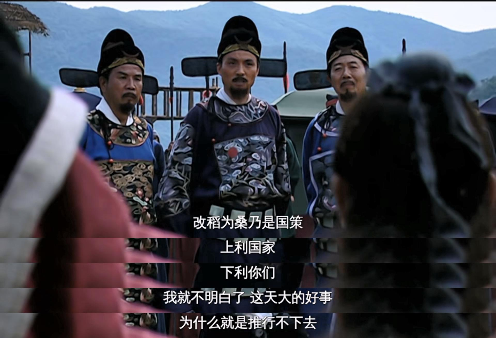

# GoTools:使用Go语言开发的工具集合

本工具是学习Go语言时开发的一些小工具，主要是面向日常中真实的需求，目前包括以下几个工具：

## 1.SubtitleJoiner

🎈**解决的需求：**
把一段影视剧中连续台词的字幕合并到一张图片中，方便截图保存，效果如下图：



✨**使用方法：**

使用go标准库中的image包，无需安装其他依赖。

需要把截图文件放到当前目录下，然后按照先后顺序命名。

本仓库中出现的截图是使用potplayer进行截图的因此已经按照时间戳进行命名了。

然后将下面代码段中的定义的变量替换成自己需要的值，然后运行即可。

```go
// 过滤当前目录下的符合给定前缀后缀的文件
var prefix = "[大明王朝1566]"
var suffix = ".jpg"
// 字幕区域高度
var subtitleHeightRatio = 0.15
// 字幕下方留白高度
var subtitleBottomMarginRatio = 0.05
```

生成的文件命名为`result.jpg`，放在当前目录下，字幕区域截图会被保存到子目录中方便调试。
